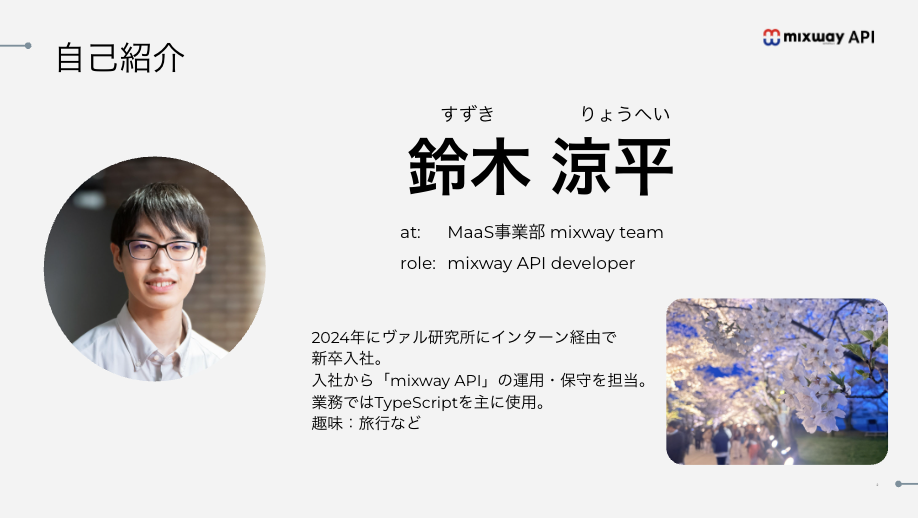
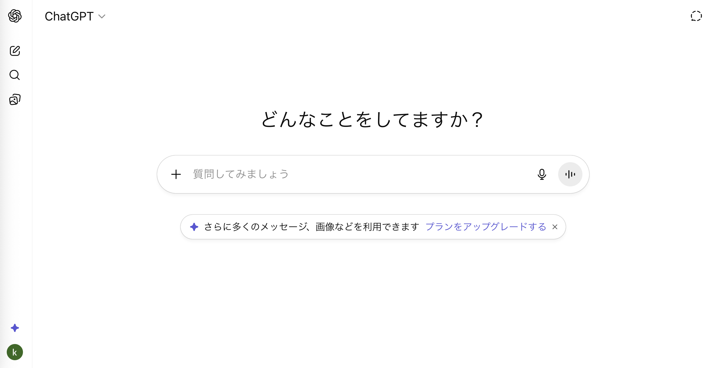
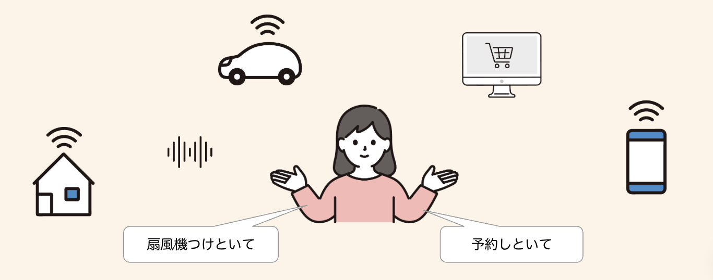
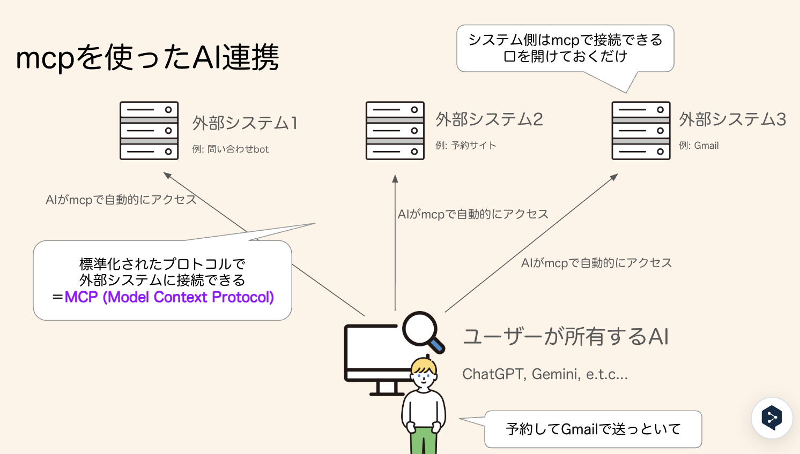
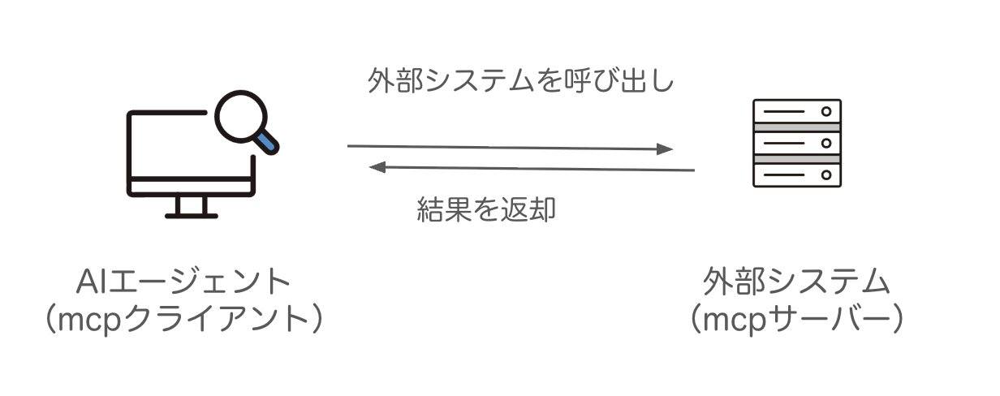

# 2025年 情報システム実験Ⅰ
# AIエージェントを作ってみよう

---

## 概要

本授業では、7回の講義を通してAIエージェントを開発します。

- AIエージェントの概要
- mcp (Model Context Protocol)
- Pythonを使用したAIエージェントの構築
- Discordを使用したAIエージェントの公開

---

## 自己紹介

2018年〜2022年 信州大学 工学部
2022年〜2024年 信州大学 大学院
2024年〜 株式会社ヴァル研究所



---

## 授業内容とスケジュール

本授業では、7回の講義を通してAIエージェントを開発します。

---

| 日付 | 内容 |
|---|---|
| 10/8 | AIエージェントとmcpについての説明<br>claude desktopのインストールとmcpの利用 |
| 10/15 | 13:00〜 discordへのinvite作業／作成したいAIエージェントの案を出す<br>15:00〜 mcpサーバーを自作してclaude desktopから呼び出す |
| 10/22 | 13:00〜 前回の続き<br>15:00〜 OpenAIのAPIをPythonから呼び出す／パラメータ調整 |
| 10/29 | 前回の続き |
| 11/12 | 13:00〜 前回の続き<br>15:00〜 AIエージェントをdiscordと接続+スライド作り |
| 11/19 | AIエージェントをdiscordと接続+スライド作り |
| 11/26 | 発表+他の人の作品を触る |


---

### スケジュールについて

- 講師の都合により、一部先生とTAさんに進行してもらう会があります。

---

## インターンの紹介（宣伝）

株式会社ヴァル研究所ではインターンを実施しています！

- [会社紹介](https://drive.google.com/file/d/1Kr8fQGCUHr_oTb_B_vD2fnUMdBf5amGR/view?usp=drive_link)
- [27卒会社説明会・選考案内](https://drive.google.com/file/d/1zJAKpR8jKkyR2yl3pVsQ8ynWF_9SMXbN/view?usp=drive_link)

---

## 今日の内容

- AIエージェントとはなにか
- mcp (Model Context Protocol)とはなにか
- 既存のAIツールを触ってみよう

---

## 今日のゴール

- AIエージェントとはなにか理解できている
- mcp (Model Context Protocol)とはなにか理解できている
- Claude Desktopを使用し、3つ以上のmcpサーバーを試すことができている

---

### 注意点

- AIエージェントはまだ発展途上の技術です。
- 場合によっては、単語の定義が曖昧であったり、情報が逐次更新されることがあります。学術的な定義があるわけではないです。
- 本講義では、AIエージェントについての一般的な解説を行うよう努めますが、個別のツールやサービスについては、最新の情報を各自で確認してください。

---

# AIエージェントとは

---

# まず質問

ChatGPT使ったことありますか？



---

# Q. ChatGPTで何ができますか？

---

# Q. ChatGPTで何ができますか？

- 質問に答える
- 文章を書く
- プログラムを書く
- 翻訳する

---

# Q. ChatGPTで、できないことは何ですか？

---

# Q. ChatGPTで、できないことは何ですか？

# A. いっぱいある。

- 飛行機の予約をする
- LINEに返信する
- エアコンをつける
- 電気を消す
- 部屋を掃除する

---

- 飛行機の予約をする
- LINEに返信する
- エアコンをつける
- 電気を消す
- 部屋を掃除する

ChatGPTにこれらをやってもらうには？

→外部システムと接続し、自律的に操作する仕組みが必要。

→ **AIエージェント**

---

## AIエージェントの定義

**AIエージェント（AI Agent）** とは、自律的にタスクを実行するAIシステムです。



---

## AIエージェントの特徴

1. **自律性（Autonomy）**
   - 指示が明確でなくても、目標達成のために何を行えばいいかAIが判断して行動する

2. **目標指向（Goal-oriented）**
   - 明確な目標を設定し、それを実現するためにステップバイステップで行動する

3. **環境への適応性**
   - 周囲の環境の情報を収集し、それに応じて行動を調整する

4. **学習能力**
   - 過去の履歴を学習し、将来の行動を改善する

---

## AIエージェントの具体例

- OpenAI Operator
  - 日常のタスクの自動化
- OpenAI Agent Builder
  - システム連携したカスタムAIエージェントの構築
- Claude Code
  - プログラミングを支援するAIエージェント
- Gemini Deep Research
  - Web検索を行うAIエージェント
- [駅すぱあと URLスマート検索](https://url-smart-search.roote.ekispert.net/)

---

## AIエージェントの利点

- **生産性の向上**
  - 繰り返しタスクの自動化
  - 並列稼働
  - 24時間稼働
- **データ処理能力**
  - 大量のデータを人間よりも高速処理
- **一貫性**: 人間のようなケアレスミスの減少

---

## AIエージェントの課題

- **セキュリティリスク**: 意図しない行動を行った場合の不正アクセスや情報漏洩の可能性
- **信頼性**: エラーやハルシネーション（幻覚）の発生
- **コスト**: 計算リソースと金銭的なコスト
- **制御の難しさ**: 意図しない行動をとった際の制御

---

# MCP (Model Context Protocol)

---

## MCPとは何か

**AIと外部ツールをつなぐための標準プロトコル**です。

---



---

## MCPの用語

AIと外部システムを接続する際の仕様・規格がMCPです。

MCPでの接続に対応しているシステム(サーバー)を「MCPサーバー」、MCPを使った外部システム呼び出しが可能なものを「MCPクライアント」と呼びます。



---

## MCPサーバーの例

様々なmcpサーバーが公開されています。

- https://mcpservers.org/
- https://mcpmarket.com/ja/server
- https://mcp.so/
- https://aiagentslist.com/mcp-servers

---

## MCPサーバーのセキュリティ

- MCPサーバーは便利な反面、使い方を誤るとセキュリティリスクがあります。
- 既存のMCPサーバーはセキュリティが考慮されていないものが多いです。
    - ローカルファイルへのアクセス（パスワード漏洩）
    - Webページの操作（ログイン情報の漏洩）
- アクセス権限が大きい分、操作ミスのリスクも高いです。
    - 間違ってファイルを消してしまった
    - 重要な情報を外部に送信してしまった

こうした問題を避けるため、**信頼できるMCPサーバーを利用する**、**MCPサーバーの利用の前に処理内容を確認する**ことが重要です。

---

## claude desktop でmcpサーバーを使ってみる

### claude desktop のインストール

https://claude.ai/download


---

### claude desktop の初期設定

- インストール後、起動してGoogleアカウントでログインしてください

---

### claude desktop の接続確認

「新規チャット」から対話できることを確認してください

---

### mcpサーバーとの接続

ローカルファイルを操作するmcpサーバーと接続してみます。

```
具体的な接続手順については以下の記事を参照してください。

https://zenn.dev/rescuenow/articles/2bd9d3a7bca510
```

---

### mcpサーバーとの接続

他のmcpサーバーと接続してみましょう。

#### 例

- [YouTube MCP Server](https://github.com/ZubeidHendricks/youtube-mcp-server) - YouTubeの情報を取得する
    - 利用にはAPIキーの発行が必要です
- [Fetch MCP Server](https://github.com/modelcontextprotocol/servers/tree/main/src/fetch) - 任意のWebページの情報を取得する
- [Ramen MCP Server](https://github.com/yusukebe/ramen-api?tab=readme-ov-file#remote-mcp) - ラーメン屋の情報を取得する
- [Random Number MCP Server](https://github.com/zazencodes/random-number-mcp) - ランダムな数字を生成する
- [天気予報 MCP Server](https://wxtech.weathernews.com/products/data/api/mcp/) - 日本国内の天気予報を取得する
    - 利用にはAPIキーの発行が必要です
- [Mapbox MCP Server](https://docs.mapbox.com/api/ja/guides/mcp-server/) - 地図情報を取得する
    - 利用にはAPIキーの発行が必要です

---

設定ファイル例

`claude_desktop_config.json`

```json
{
  "mcpServers": {
    "ramen-mcp": {
      "command": "cmd",
      "args": [
        "/c",
        "npx",
        "-y",
        "mcp-remote",
        "https://ramen-api.dev/mcp"
      ]
    }
  }
}
```

---

## その他

#### claude desktop の再起動

左上のハンバーガーメニュー → ファイル → 終了

#### npmコマンドのインストール

```
winget install OpenJS.NodeJS.LTS
```

#### uvのインストール

```
winget install --id=astral-sh.uv -e
```

---

### mcpサーバーとの接続

mcpサーバーへの接続を3つ以上試せたら今日の講義は終了です！

# 次回予告

- 作成してみたいAIエージェントの案を出す
- 簡単なmcpサーバーの作成
