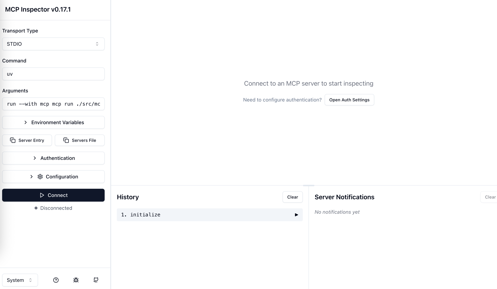

# 情報システム実験Ⅰ 第2回

---

# 今回やること

- discordへのinvite作業
- 作成したいAIエージェントの案を出す
- mcpサーバーを自作してclaude desktopから呼び出す

---

# 今日のゴール

- discordサーバーに参加できている
- 作成したいAIエージェントの案を出せている
- 簡単なmcpサーバーを作成してclaude desktopから呼び出すことができている

---

# discordサーバーへの参加

連絡やAIエージェント構築にdiscordを利用します。

授業ページにある招待リンクを踏み、discordへ参加してください。


---

# 作成したいAIエージェントの案出し

- 作成してみたいAIエージェントの案を考えてみましょう。


---

# mcpサーバーの作成

---


| - | スケジュール（再掲） |
|---|---|
| 第1回 | AIエージェントとmcpについての説明<br>claude desktopのインストールとmcpの利用 |
| 第2回 | 13:00〜 discordへのinvite作業／作成したいAIエージェントの案を出す<br>15:00〜 mcpサーバーを自作してclaude desktopから呼び出す |
| 第3回 | 13:00〜 前回の続き<br>15:00〜 OpenAIのAPIをPythonから呼び出す／パラメータ調整 |
| 第4回 | 前回の続き |
| 第5回 | 13:00〜 前回の続き<br>15:00〜 AIエージェントをdiscordと接続+スライド作り |
| 第6回 | AIエージェントをdiscordと接続+スライド作り |
| 第7回 | 発表+他の人の作品を触る |

---

# 最終発表までに作成してもらうmcpサーバーについて

- 何かしら、動作するmcpサーバーを最終発表までに作成してもらいます。
- 先ほど考えてもらったAIエージェントの案をベースにしてもいいですし、別のものでも構いません。
- mcpサーバーとしてAIと疎通できていればよいです。「予約」「購入」などの操作はダミーで構いません。

---

# Notebook LM

授業資料と関連するデータを含むNotebook LMを配布します。
以下のリンクからアクセスできます。

https://notebooklm.google.com/notebook/5af0f502-30b6-48e4-9904-95e1a87a9cd6?authuser=1

---

# 簡単なmcpサーバーを作ってみる

今回はまず、練習として簡単なmcpサーバーを作成してみます。

#### mcpサーバーでできること

- 検索
- 計算
- その他の処理なんでも

今回はサンプルとして、「足し算を行うmcpサーバー」と「食材から献立を返すmcpサーバー」を作成してみます。

---

## 1. 足し算を行うmcpサーバー

1. 作業フォルダを作成します。
2. 以下のコマンドを実行します。

```shell
cd <先ほど作成した作業フォルダ>
uv init
uv add "mcp[cli]"
```

3. vscodeなどのエディタで、作業フォルダを開きます。

---

## 1. 足し算を行うmcpサーバー（2）

`src/mcp_server.py`を作成し、以下のコードを記述します。

```python
# src/mcp_server.py
from mcp.server.fastmcp import FastMCP
# from typing import TypedDict

mcp = FastMCP(name="menu-tool")

@mcp.tool()
def sum(a: int, b: int) -> int:
    """Add two numbers together."""
    return a + b
```

足し算をして返すだけの内容になっています。

---

### 1. 足し算を行うmcpサーバー（3）

動作確認をします。
以下のコマンドを実行します。

```shell
uv run mcp dev ./src/mcp_server.py
```

デバッグ用の画面が立ち上がります。

---

### 1. 足し算を行うmcpサーバー（4）

デバッグツールで動作確認していきます。

まず右下の「connect」をクリックします。



---

### 1. 足し算を行うmcpサーバー（5）

`Tool`>`List Tools`>`Sum`の順にクリック


---

### 1. 足し算を行うmcpサーバー（6）

`a`と`b`に数字を入れて、`Run Tool`をクリックし、結果が返ってくることが確認できればOKです。 :tada:
（例: 2と3を入れたら5が返ってくる）


---

### 2. 食材から献立を返すmcpサーバー

先ほど作成した`src/mcp_menu.py`の末尾に次ページのコードを追記します。

---

```python
## 2. 食材から献立を返すmcpサーバー
menus = {
    "野菜炒め": ["キャベツ", "人参", "ピーマン", "もやし", "醤油"],
    "豚の生姜焼き": ["豚肉", "生姜", "醤油"],
    "お好み焼き": ["キャベツ", "小麦粉", "卵", "豚肉", "ソース"],
    "餃子": ["豚肉", "キャベツ", "ニラ", "餃子の皮", "醤油"],
}

@mcp.tool()
def menu(ingredient: str) -> list[dict[str, list[str]|str]]:
    """Return a menu based on the given ingredient."""
    result = []
    for k, v in menus.items():
        if ingredient in v:
            result.append({
                "menu": k,
                "ingredients": v,
            })
    return result
```

---

### 2. 食材から献立を返すmcpサーバー（2）

1. デバッグツールで`Restart`>`Tools`>`Clear`>`List Tools`>`menu`の順にクリック
2. `ingredient`に食材を入れて、`Run Tool`をクリックし、結果が返ってくることが確認できればOKです。 :tada:

（例: 「豚肉」を入れたら「豚の生姜焼き」「お好み焼き」「餃子」が返ってくる）


---

## claude desktopから呼び出す

1. 以下のコマンドを実行します。

```
uv run mcp install ./src/mcp_server.py
```

`claude_desktop_config.json`に設定が自動で書き込まれるはずなので確認してください。

2. claude desktopを再起動し、チャットからmcpサーバーが利用できることを確認してください。

---

# 次にやること

- 独自のmcpサーバーを作成してみましょう！
- 次回以降も作業時間を取るので、キリのよいところで帰って大丈夫です。
- おつかれさまでした！

# 次回予告

- OpenAIのAPIをPythonから呼び出してみる
