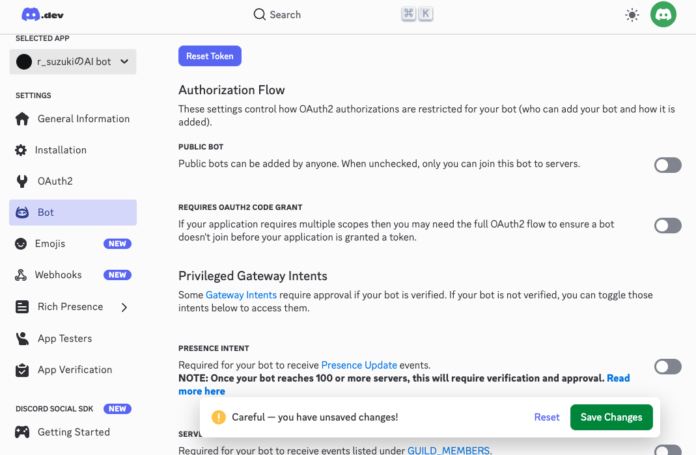

# 情報システム実験Ⅰ 第5回

---

- 13:00〜
  - 前回の続き
  - スライド作成
- 15:00〜
  - discord botを使用したAIエージェントの作成

---

## discord botの作成

https://discord.com/developers/applications からアプリケーションを作成する


---

- botの名前を入力（なんでもよいです。後から変えられます）
- チェックを付ける
- Createを押す


---

- 左のメニューから「Installation」を選択
- Install Linkで`None`を選択
- `Save Changes`を押す


---

- 左のメニューから「Bot」を選択
- 「PUBLIC BOT」をオフにする
- `Save Changes`を押す



---

- 同じく「Bot」ページで、Privileged Gateway Intentsの下の
  - `PRESENCE INTENT`をオンにする
  - `SERVER MEMBERS INTENT`をオンにする
  - `MESSAGE CONTENT INTENT`をオンにする
- `Save Changes`を押す


---

- 左のメニューから「OAuth2」を選択
- `OAuth2 URL Generator`内で、
  - `bot`にチェックを入れる
  - 更に下にスクロール
  - `Administrator`にチェックを入れる


---

- OAuth2から、一番下の`Generated URL`をコピーしてブラウザで開く
- `ai-agent-study`を選択し、インストール
- discordサーバーにbotが追加される


---

# Pythonでオウム返しbotを作る

---

## 事前準備

- Pythonファイルを追加するフォルダを作成しましょう

---

まずトークンを取得する。
- 左のメニューから「Bot」を選択
- `TOKEN`の`Reset Token`を押す
- 新しいアクセストークンが発行されるので、コピーする
  - **このトークンは絶対に他人に知られないように注意してください。**


`.env`ファイルを作成し、以下の内容を書き込む

```
BOT_TOKEN=＜先ほどコピーしたトークン＞
```

---

```
brew install uv
cd 該当ディレクトリ
uv init
uv add discord.py python-dotenv
```

---

- `src/discord_agent.py`を以下のように編集

```python
import discord
from dotenv import load_dotenv
import os

load_dotenv()

bot_token = os.getenv("BOT_TOKEN")

intents = discord.Intents.all()

client = discord.Client(intents=intents)

@client.event
async def on_ready():
    print("botが起動しました")

@client.event
async def on_message(message):
    # 自分が送信したメッセージに対しては反応しない
    if message.author == client.user:
        return
    # 自分にメンションされた時しか反応しない
    if client.user not in message.mentions:
        return

    # メッセージが送信されたチャンネルに、同じメッセージをオウム返しする
    await message.channel.send(message.content)

client.run(bot_token)
```

---

# AIの追加

ライブラリのインストール

```
uv add nest_asyncio
```

---

以下のように変更

```diff
    import discord
    from dotenv import load_dotenv
    import os
+   from agents import Agent, Runner, ModelSettings, WebSearchTool
+   from agents.mcp import MCPServerStdio
+   import asyncio
+   import nest_asyncio
+   nest_asyncio.apply()

    load_dotenv()

    bot_token = os.getenv("BOT_TOKEN")

    client = discord.Client(
        intents=discord.Intents.all()
    )
```
(次ページへ続く)

---

(続き)

```diff
+   async def main():
+       async with MCPServerStdio(
+           name="天気予報ツール",
+           params={
+               # 起動コマンドは各自の環境に合わせて切り替え
+               "command": "uv",
+               "args": [
+                   "--directory",
+                   "/Users/r_suzuki/work/ai-agent-study/",
+                   "run",
+                   "--with",
+                   "mcp[cli]",
+                   "mcp",
+                   "run",
+                   "./src/mcp_server.py",
+               ],
+           },
+       ) as server:
+           agent = Agent(
+               name="Assistant",
+               model="gpt-5-mini",
+               # model_settings=ModelSettings(temperature=0),
+               instructions="あなたは親しみのあるdiscord botです。簡潔に応答してください。",
+               mcp_servers=[server],
+               # tools=[
+               #     WebSearchTool(),
+               # ],
+           )


            @client.event
            async def on_ready():
                print("botが起動しました")

            @client.event
            async def on_message(message):
                # 自分が送信したメッセージに対しては反応しない
                if message.author == client.user:
                    return
                # 自分にメンションされた時しか反応しない
                if client.user not in message.mentions:
                    return
+               # AI応答を生成
+               result = await Runner.run(agent, message.content)
+               print(result.final_output)

+               # メッセージが送信されたチャンネルに、AI応答を送信
+               await message.channel.send(result.final_output)

            client.run(bot_token)

    asyncio.run(main())
```

---

### 動作確認

1. ターミナルに「botが起動しました」と表示されていることを確認
2. discordのサーバー上でbotにメンションを飛ばしてみる（例: `@BotName 今日の長野県の天気を教えて`）
