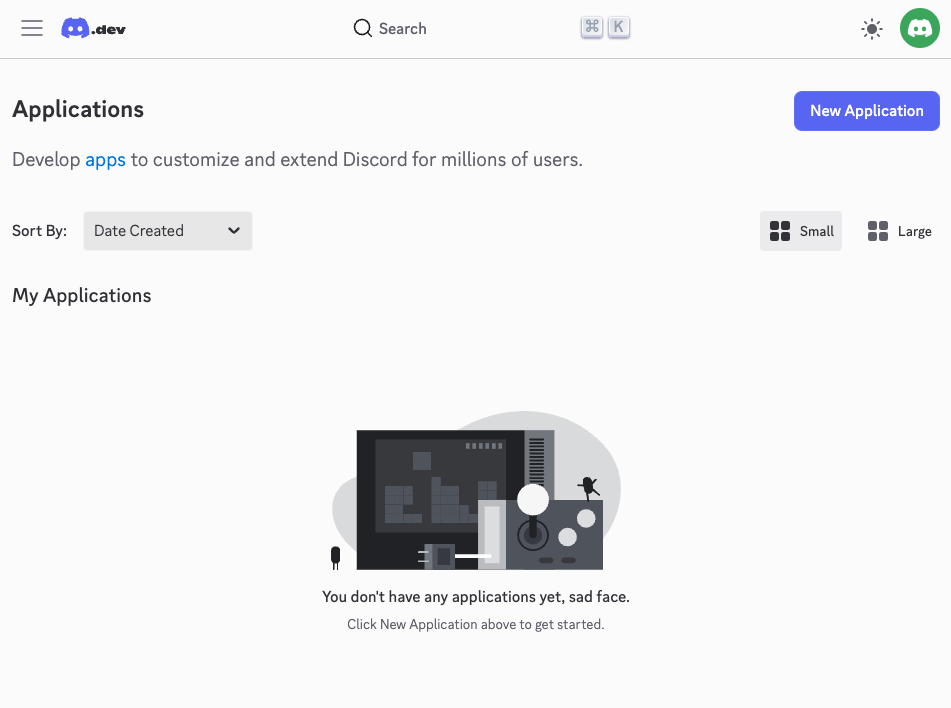
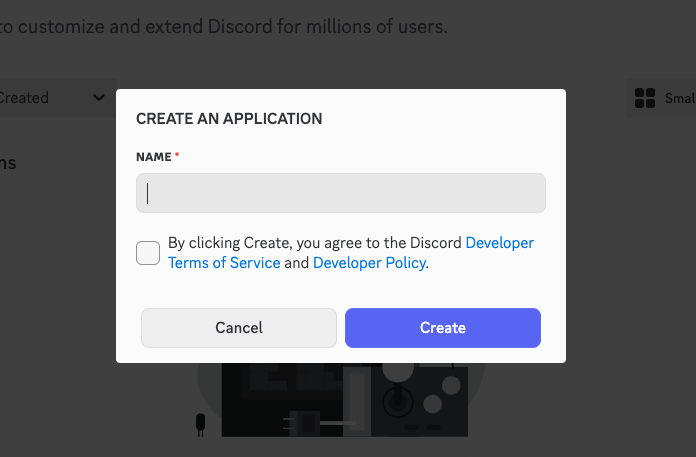
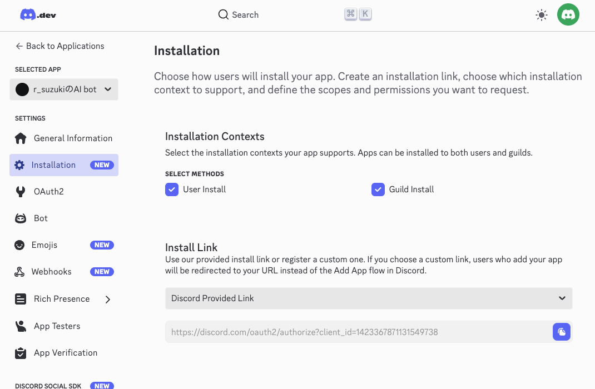
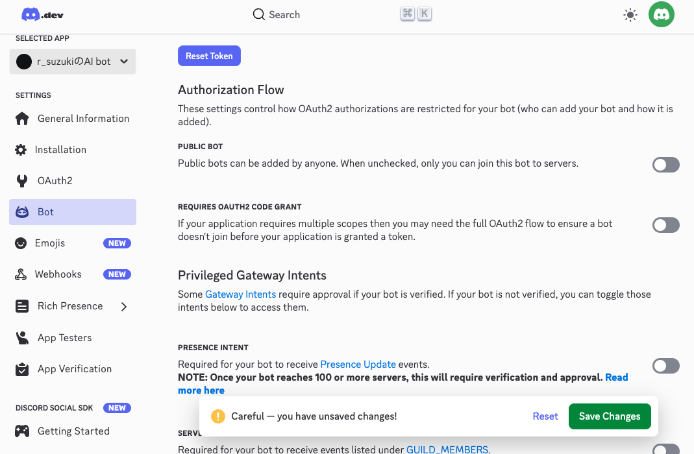
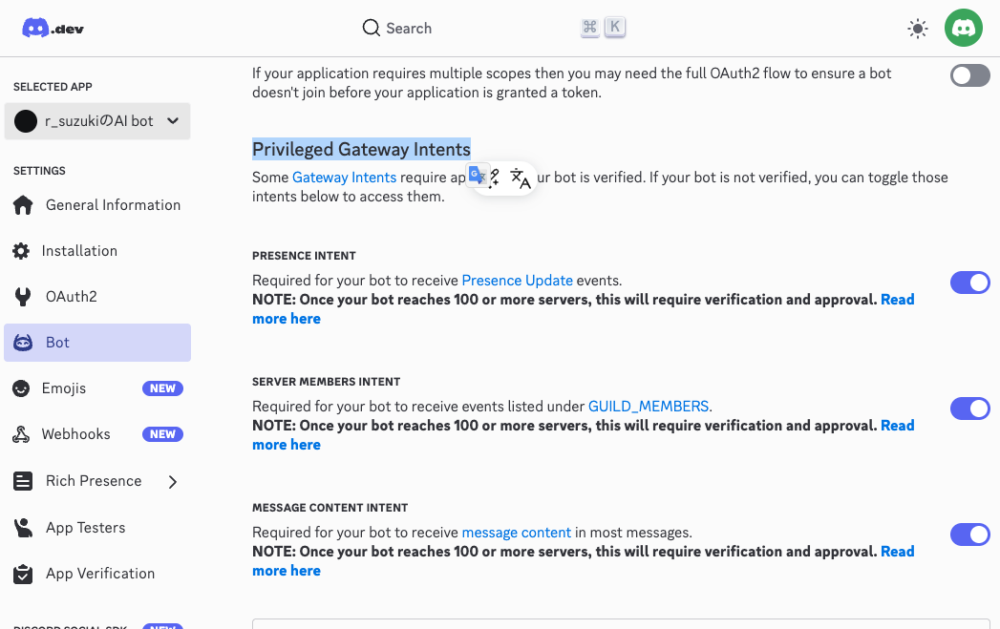
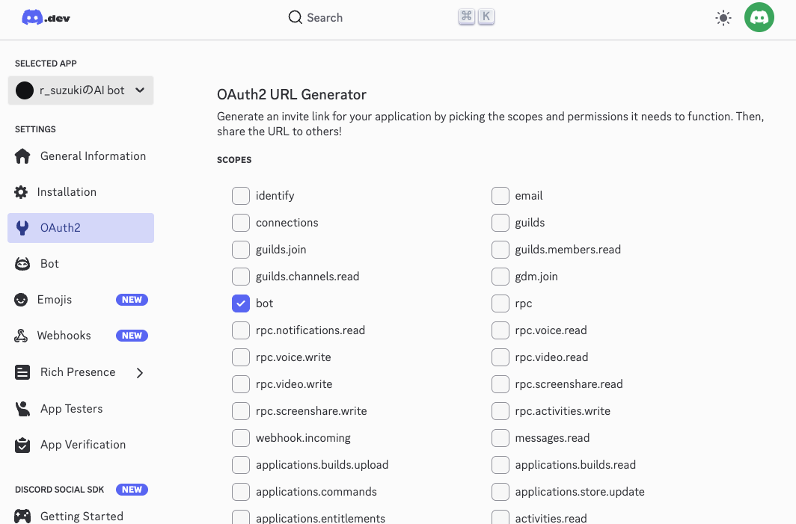
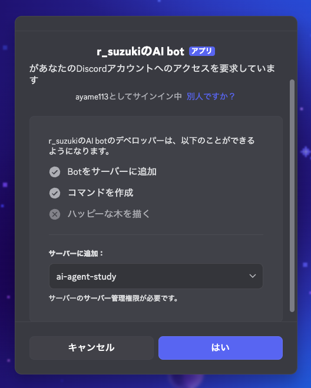

# discord botの作り方

---

https://discord.com/developers/applications からアプリケーションを作成する




---

- botの名前を入力（なんでもよいです。後から変えられます）
- チェックを付ける
- Createを押す



---

- 左のメニューから「Installation」を選択
- Install Linkで`None`を選択
- `Save Changes`を押す



---

- 左のメニューから「Bot」を選択
- 「PUBLIC BOT」をオフにする
- `Save Changes`を押す



---

- 同じく「Bot」ページで、Privileged Gateway Intentsの下の
  - `PRESENCE INTENT`をオンにする
  - `SERVER MEMBERS INTENT`をオンにする
  - `MESSAGE CONTENT INTENT`をオンにする
- `Save Changes`を押す



---

- 左のメニューから「OAuth2」を選択
- `OAuth2 URL Generator`内で、
  - `bot`にチェックを入れる
  - 更に下にスクロール
  - `Administrator`にチェックを入れる




---

- OAuth2から、一番下の`Generated URL`をコピーしてブラウザで開く
- `ai-agent-study`を選択し、インストール
- discordサーバーにbotが追加される



---

# Pythonでオウム返しbotを作る

---

## 事前準備

- Pythonファイルを追加するフォルダを作成しましょう

---

まずトークンを取得する。
- 左のメニューから「Bot」を選択
- `TOKEN`の`Reset Token`を押す
- 新しいアクセストークンが発行されるので、コピーする
  - **このトークンは絶対に他人に知られないように注意してください。**


`.env`ファイルを作成し、以下の内容を書き込む

```
BOT_TOKEN=＜先ほどコピーしたトークン＞
```

---

```
brew install uv
cd 該当ディレクトリ
uv init
uv add discord.py python-dotenv
```

---

- `src/main.py`を以下のように編集

```python
import discord
from dotenv import load_dotenv
import os

load_dotenv()

bot_token = os.getenv("BOT_TOKEN")

intents = discord.Intents.all()

client = discord.Client(intents=intents)

@client.event
async def on_ready():
    print("botが起動しました")

@client.event
async def on_message(message):
    # 自分が送信したメッセージに対しては反応しない
    if message.author == client.user:
        return
    # 自分にメンションされた時しか反応しない
    if client.user not in message.mentions:
        return

    # メッセージが送信されたチャンネルに、同じメッセージをオウム返しする
    await message.channel.send(message.content)

client.run(bot_token)
```

---

# AIの追加

ライブラリのインストール

```
uv add openai
```

`.env`にOpenAIのAPIキーを追加

```env
BOT_TOKEN=＜discordのトークン＞
OPENAI_API_KEY=＜OpenAIのAPIキー＞ # この行を追加
```

---

以下のように変更

```diff
 import discord
 from dotenv import load_dotenv
 import os
+from openai import OpenAI
 
 load_dotenv()
 
(----中略----)
 
 client = discord.Client(intents=intents)
 
+openai = OpenAI(
+    api_key=os.getenv("OPENAI_API_KEY"),
+)
+
 @client.event
 async def on_ready():
     print("botが起動しました")
 
 @client.event
 async def on_message(message):
     # 自分に対しては反応しない
     # 自分が送信したメッセージに対しては反応しない
     if message.author == client.user:
         return
     # 自分にメンションされた時しか反応しない
     if client.user not in message.mentions:
         return
+    # AI応答を生成
+    response = openai.responses.create(
+        model="gpt-5-mini",
+        instructions="あなたは親しみのあるdiscord botです。簡潔に応答してください。",
+        input=message.content,
+    )
+
+    print(response.output_text)
 
-    # メッセージが送信されたチャンネルに、同じメッセージをオウム返しする
-    await message.channel.send(message.content)
+    # メッセージが送信されたチャンネルに、AI応答を送信
+    await message.channel.send(response.output_text)
 
 client.run(bot_token)
```
